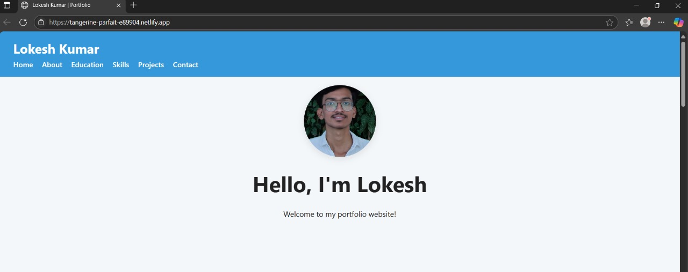
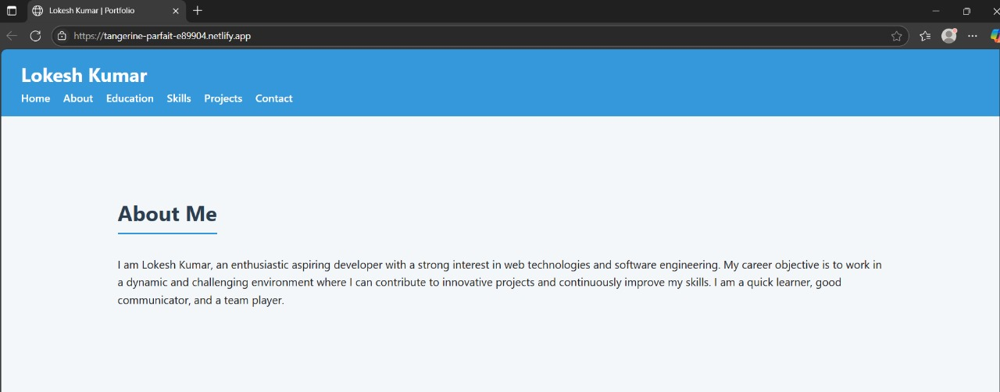
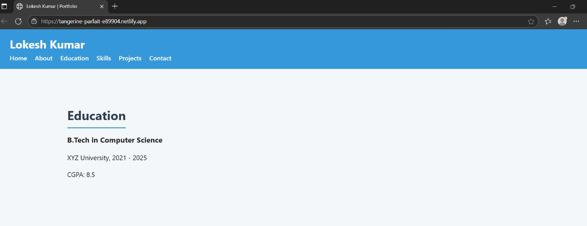
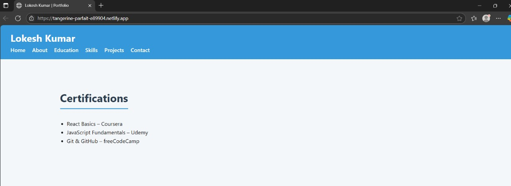
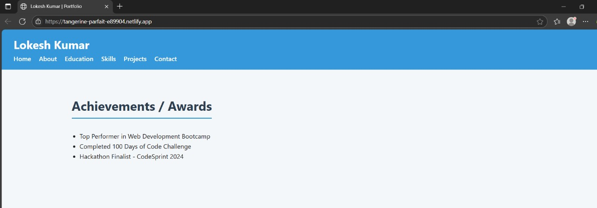

# 🚀 Lokesh's Portfolio Website

Welcome to my personal developer portfolio website built using **React.js**.  
This site showcases my skills, projects, and contact information in a modern, responsive layout.

🌐 **Live Demo**: [https://lokeshsomapalli.github.io/portfolio](https://lokeshsomapalli.github.io/portfolio)  
📁 **Repository**: [GitHub Repo](https://github.com/lokeshsomapalli/portfolio)

---

## 📌 About the Project

This is a single-page portfolio application that includes the following sections:

- 🧑‍💼 About Me  
- 🛠️ Skills  
- 💼 Projects  
- 📞 Contact Information  

It is fully responsive and styled using CSS, with a clean, professional layout.

---

## 🖥️ Tech Stack

- **Frontend**: React.js  
- **Styling**: CSS3  
- **Version Control**: Git + GitHub  
- **Deployment**: GitHub Pages

---

## 📸 Screenshots

> Store these images in a /screenshots/ folder inside your root project and update if needed.

### 🏠 Home Page

### 🏠 Aboutme Page

### 🎓 Education Timeline

### 📜 Certificates

### Achievements

